# WordHunt

## Overview of project ##

Welcome to WordHunt! WordHunt is a Python based terminal game that provides an entertaining word guessing game.

Visit the deployed site: [WordHunt deployment](https://word-hunt-lo-22f0c19fc78e.herokuapp.com/)

## Initial planning ##

WordHunt provides users with an interactive, menu-driven game. During the initial planning stage I used LucidChart:
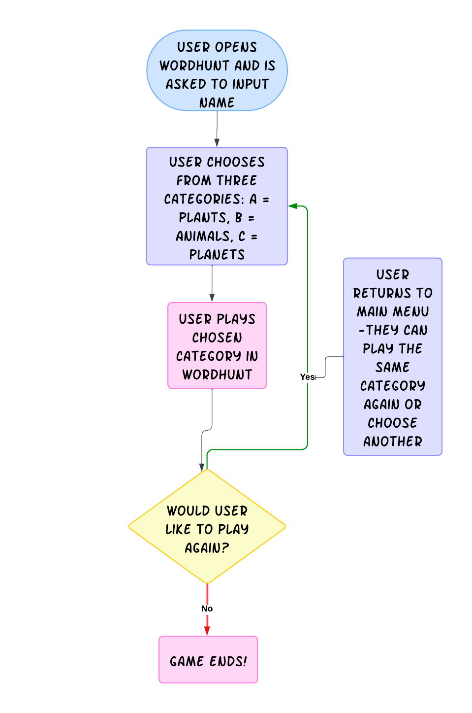

As WordHunt developed, I decided to enhance this original plan by creating a more interactive and informative experience for users. This involved welcoming users and offering them the option to see the game instructions before inputting their name and starting WordHunt. The game itself was developed as originally planned. 

## User Stories ##

1. As a first-time visitor, I want to play a word guessing game.
2. As a first time visitor, I want the site to be intuitive and welcoming, so I can easily navigate the instructions and begin playing the game. 
3. As a first time or returning user, I want clear instructions about how to play the game.
4. As a first time or returning user, I want to be able to select different categories so I can enjoy a range of topics.
5. As a first time or returning user, I want to receive feedback throughout the experience.
6. As a first time or returning user, I want to have a sufficient amount of guesses when guessing the words.
7. As a first time or returning user, I want two know how many guesses are left.
8. As a first time or returning user, I want to receive feedback on my performance. 
9. As WordHunt, I want to create a fun and engaging game that entertains users.
10. As WordHunt, I want to create an accessible and enjoyable game to ensure inclusivity and allow the quiz to grow in reach and popularity.

## Features ##

### How to Play ###

The user is welcomed to WordHunt and given the option to read the instructions or start the game. 

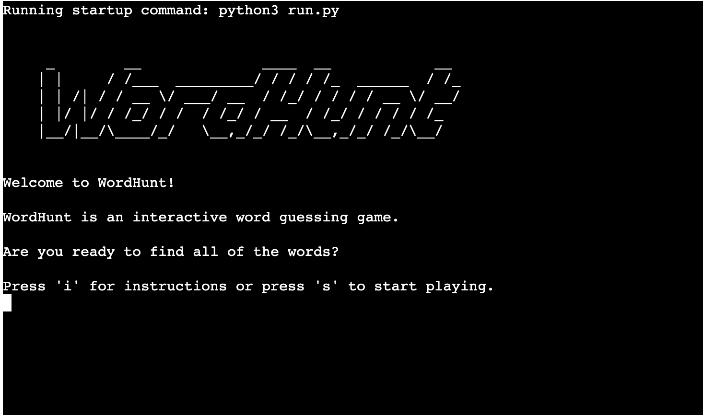
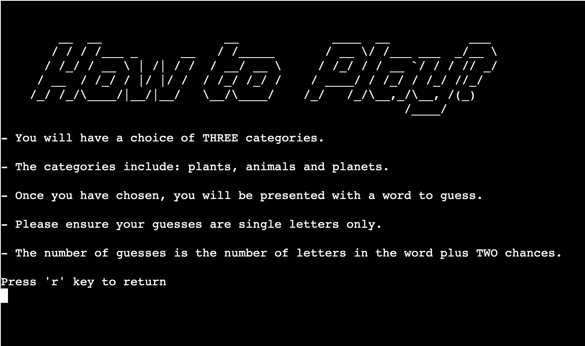

When they enter the game, the user is asked to input their name. This is used throughout the game to give the user feedback. The purpose of requiring the user to enter a name is to make the feedback more personal and engaging. 

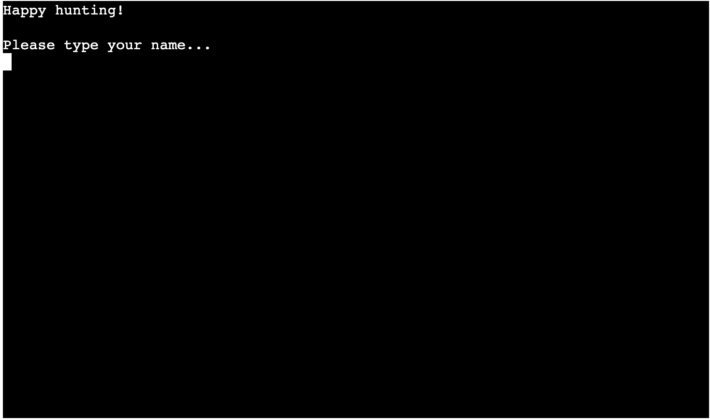

The user receives a good luck message and is presented with three categories: plants, animals and planets. These categories were selected as they thematically relate to nature, Earth and the Solar System, but are varied enough to offer users different options and appeal to a wide range of people.

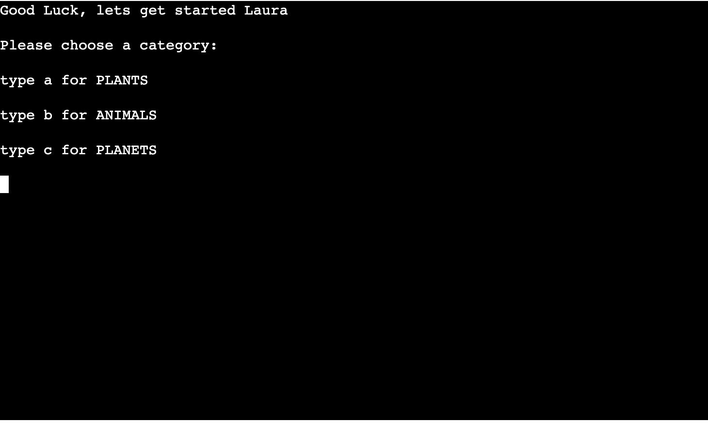

Once the user has selected a category they enter the game and can begin guessing. Due to the nature of the categories, the words are various lengths, for example in "Plants", the smallest word "rose" has only four letters compared to the longest word, "sunflower" with nine letters. 

To ensure the user has a fair chance at finding the words, but also give them a challenge, the number of guesses is equal to the length of the word plus two more guesses. Therefore "rose" would have six guesses compared to "sunflower" with eleven guesses. Various number options were tested for the extra guesses and two provided the most entertainment and user satisfaction. The words are also presented in a random order to provide variety when playing WordHunt. 

The user can see how many guesses they have and how many letters the word contains before guessing, this is accompanied by empty underlines that will be updated as they guess correctly.

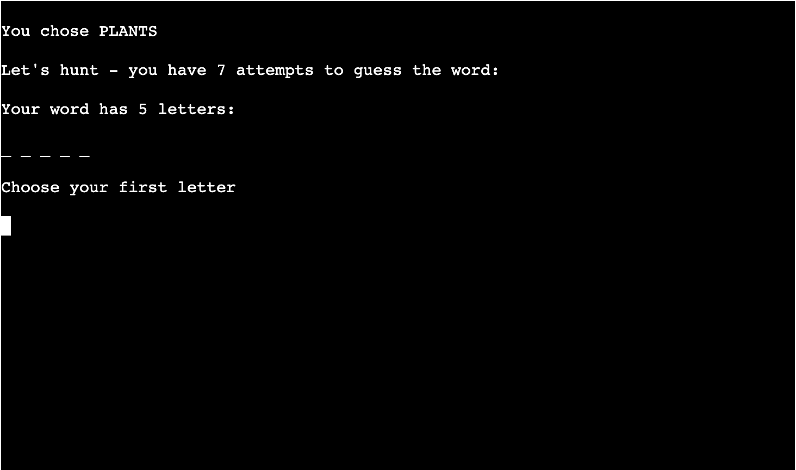

If the user guesses a letter correctly, the letter is added to the correct space and the number of remaining guesses lowers with each guess. If the user guesses incorrectly, they are asked to choose their next letter and again the number of remaining guesses lowers with each guess. 

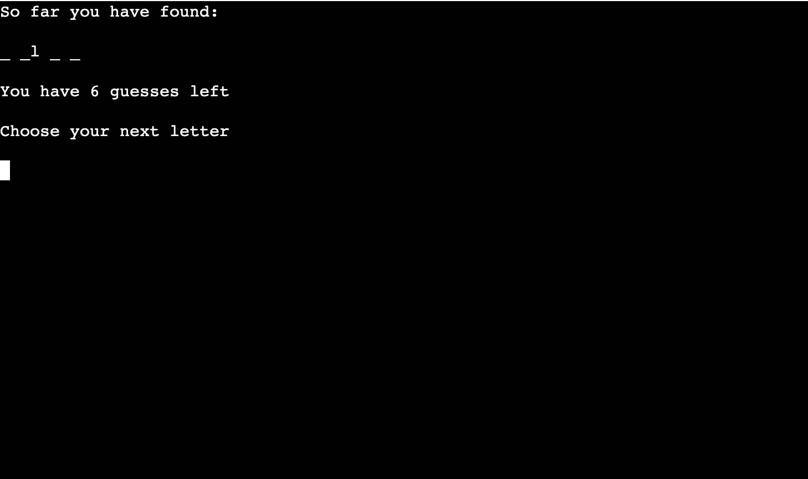
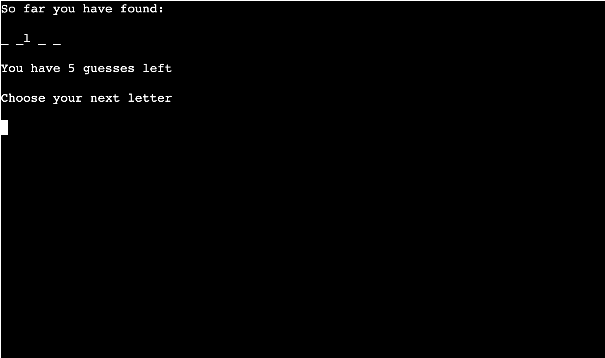

Users are given feedback if they enter the same letter twice, type two letters or give an invalid character e.g. a number or special character. In this example, the number "1" and two letters "hh" each receive the relevant feedback:

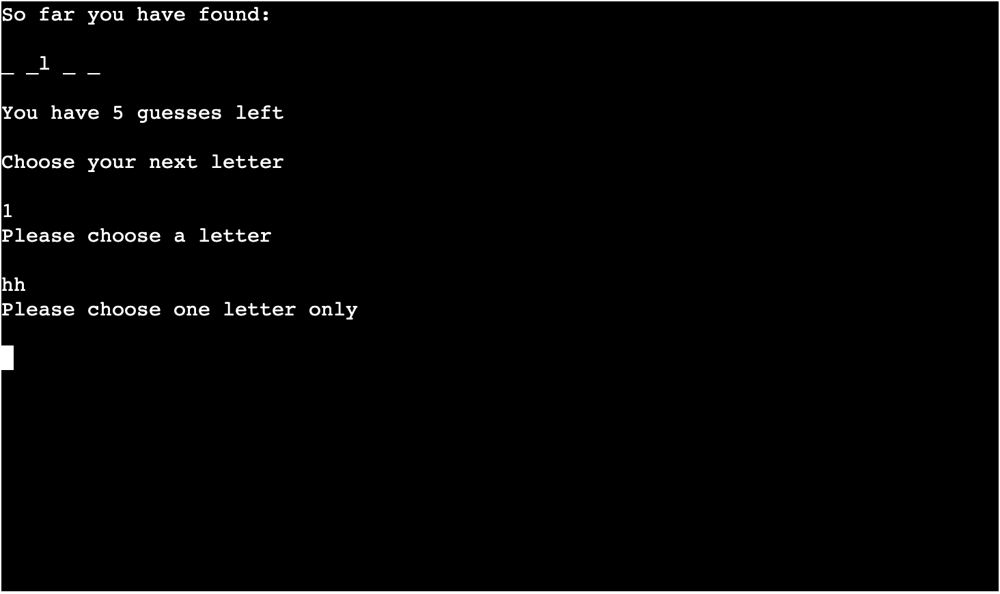

When the user correctly guesses a word, they receive a well done message alongside the correctly guessed word, and an ASCII art trophy.

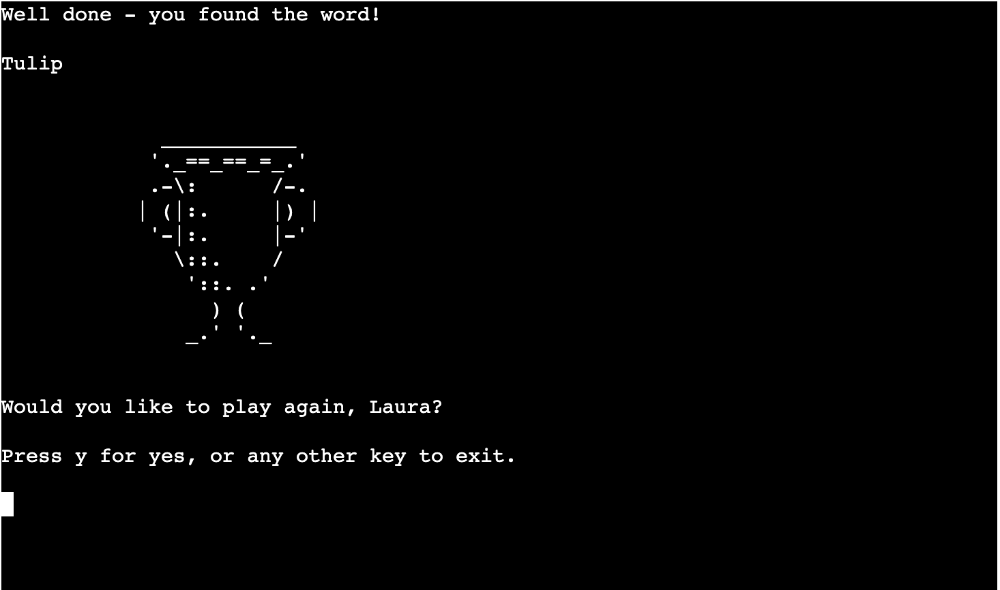

When the user does not guess the word within the number of guesses allotted, they receive a hard luck message alongside the correct word.

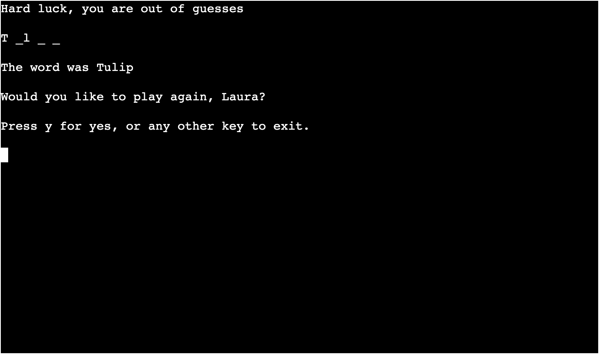

Both successful and unsuccessful players are invited to play the game again. If users choose yes, they are presented with the categories and enter the game again. This allows them the option of choosing the same category or trying something new to hold their interest. 

If users enter any other key, they receive a Goodbye message encouraging them to come back soon. 

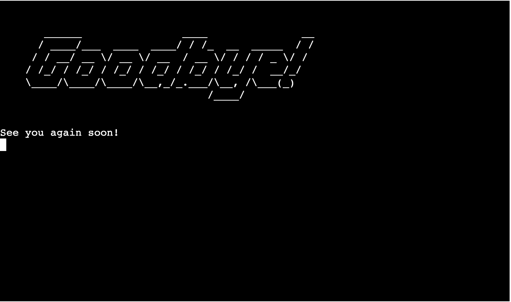

### Future Development ###

Possible upgrades I would like to implement include:
- Incorporate additional categories to expand the game.
- Introduce optional time limits to give the user a finite amount of time to guess the word.

## Testing ##

### CI Python Linter ###

All code passed with no errors:

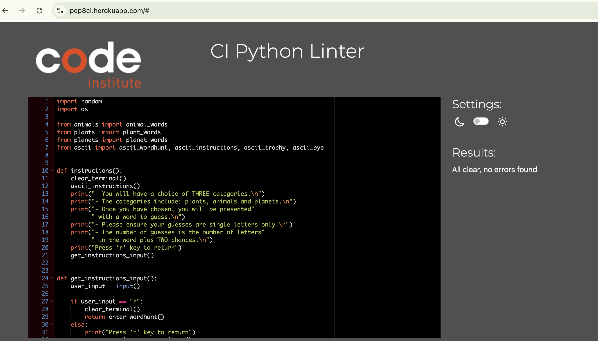

### Manual Testing ###

Each feature has been tested thoroughly and each gives the expected outcome:

- When users press "i" they are taken to the game instructions: pass.
- When users press "r" in the instructions they return to the welcome page: pass.
- When users press "s" they enter the game: pass.
- Users receive feedback (Please choose 'i' or 's' only) if they do not press either option: pass.
- Users must type a name to enter the game, and receive feedback ("Please enter at least two letters") if they press enter, give only one letter or a number: pass.
- When users select category "a", "b", or "c", they enter the relevant category game, and are given feedback to choose a valid category if they give a different letter or a number: pass.
- When users start playing they know how many guesses they start with and the number decreases with each guess: pass.
- During the game, users are given feedback to ensure they only choose one letter and don't repeat letters ("Please choose a letter", "You have already picked _", "Try a new letter", "Please choose one letter only"): pass. 
- When the user correctly guesses a word, they receive a well done message alongside the correctly guessed word, and an ASCII art trophy: pass.
- When the user does not guess the word within the number of guesses allotted, they receive a hard luck message alongside the correct word: pass.
- When users press "y" at the end of the game, they enter the game again: pass.
- When users enter any other key, they receive a Goodbye message and exit the game: pass.

## Deployment ##

WordHunt was created using Gitpod Enterprise and Heroku has been used to deploy the live WordHunt website: [WordHunt deployment](https://word-hunt-lo-22f0c19fc78e.herokuapp.com/)

### Heroku ###

The steps to deploy through Heroku are as follows:
- Log into Heroku or create an account.
- Select Settings and enter the app name.
- Select build packs for Python and Node.js.
- Select Deploy and choose GitHub for Deployment Method. 
- Connect to GitHub and enable Automatic Deploys so each push command (- `git push) to GitHub deploys on the live app/site. 

### Clone from Github ###

The steps to clone this repository are as follows:

- On the repository's GitHub page, click on the "Code" button.
- In the dropdown, click on "Clone" to copy the repository's URL to your clipboard.
- Open your Terminal or Git Bash.
- Navigate to the directory where you want to clone the repository.
- In your IDE Terminal, use the git clone command (- `git clone) followed by the URL you copied earlier to create your local clone.

### Fork from Github ###

The steps to fork this repository are as follows:

- On the repository's GitHub page, click on the "Fork" button at the top-right corner.
- Once forked, the repository will be available under your GitHub account.

## Tools and Tech Used ##

[GitPod Enterprise](https://www.gitpod.io/) used for coding and developing WordHunt. 

[GitHub](https://github.com) used for online code storage and deployment to Heroku).

[Heroku](https://id.heroku.com/login) used for deployment. 

[ASCII Art Archive](https://www.asciiart.eu/) ASCII art generator used to turn text into art.

[ASCII Art Image](https://ascii.co.uk/art/trophy#google_vignette) used for ASCII art trophy.

[Python string interpolation](https://www.geeksforgeeks.org/python-string-interpolation/) used for further information on how to build a string with variables.

[Clear screen](https://www.geeksforgeeks.org/clear-screen-python/) used os module to clear terminal.

[Print ASCII art](https://www.geeksforgeeks.org/ways-print-escape-characters-python/) used “r"option to print backslashes without escape character. 

## Acknowledgements ##  

I would like to thank my Code Institute mentor Chris Quinn for their support and guidance during this project.